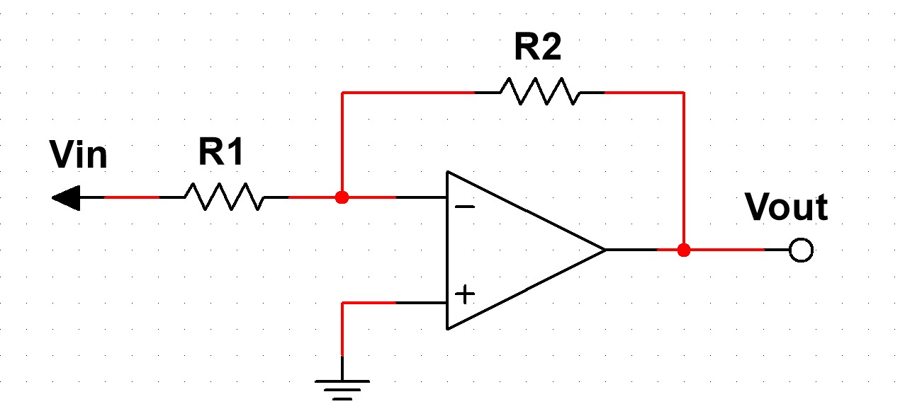
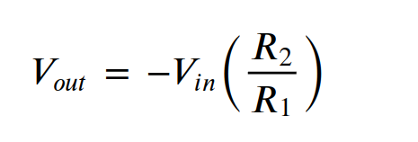
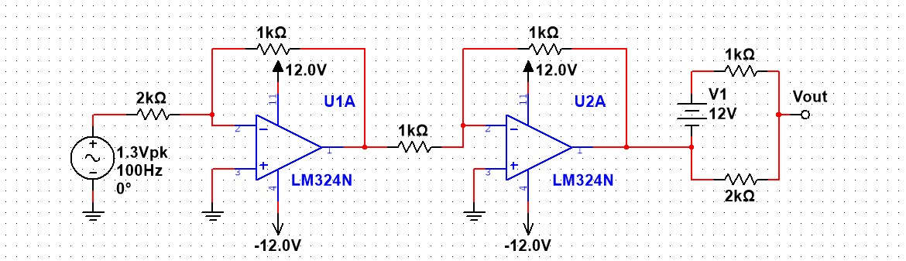
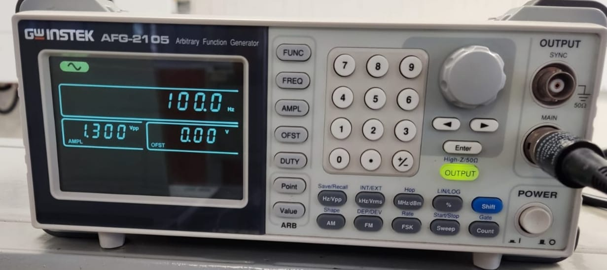
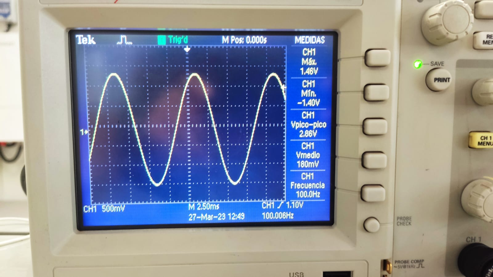
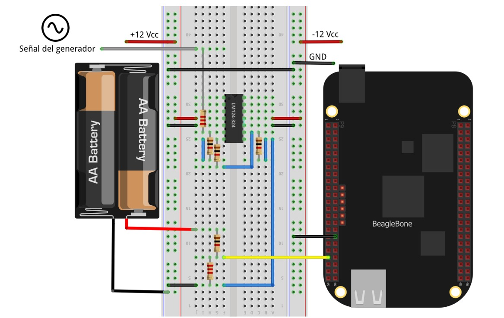
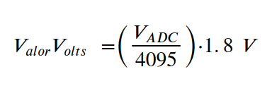
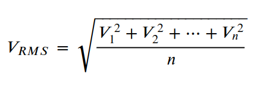
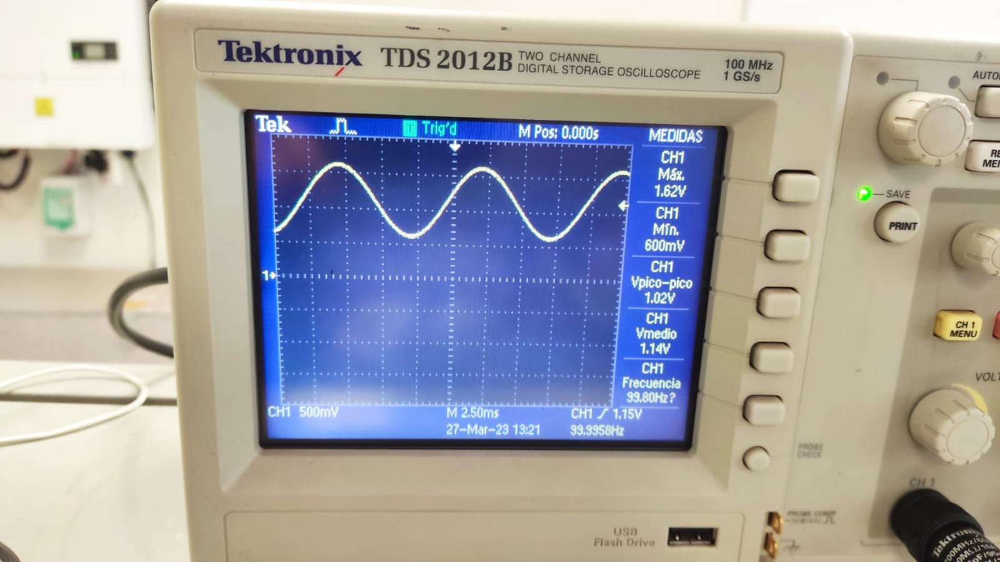
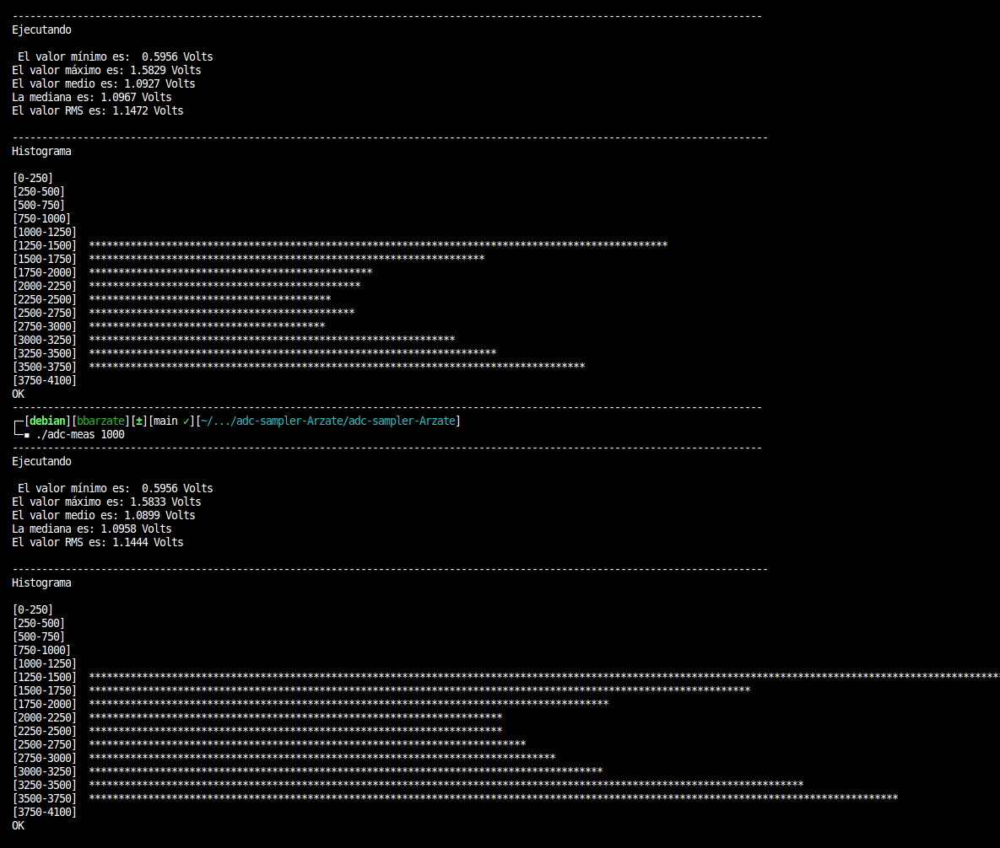

# adc-sampler

Implemente el siguiente registrador de datos para el ADC usando C para programar la función para recolectar 500-1000 muestras y calcular los datos requeridos.


## Acondicionamiento de la señal

Para realizar una correcta lectura en el ADC0 de la BeagleBone Black o para cualquier otro de los 6 canales restantes se debe tener en cuenta que los ADCs tienen un rango de medición de 0 a 1.8 Volts, conectar un voltaje superior a este puede dañar la placa.


En el acondicionamiento de la señal se utilizó un generador para obtener una señal senoidal de 3 Vpp, con un amplificador inversor con resistencias de 1k ohms y 2k ohms se redujo a la mitad la amplitud de la señal, con un segundo amplificador inversor con resistencias de igual valor se invierte nuevamente la señal para corregir él desface generado con el primer amplificador, y  por último, se utiliza una fuente de voltaje de CD con dos resistencias para sumar 1 V y obtener un valor mínimo superior a 0 V (Desplazar el offset al voltaje positivo).




El circuito resultante se muestra a continuación.


## Conexiones 

Configuración de la señal de entrada senoidal de 3 Vpp a 100 Hz. 





Conexiones del circuito en una protoboard. 


**Nota: En la protoboard se muestran tres circuitos diferentes, el utilizado en este caso es el armado en el centro.**



En la imagen anterior se muestra la conexión del circuito con la BeagleBone, se puede observar que en la placa se utilizan los pines `AIN0` para especificar el ADC0 y `GND_ADC` para la tierra.

**Recomendación: Es importante revisar la salida del circuito en un osciloscopio antes de conectar a la BeagleBone esto para garantizar que el rango de voltaje sea adecuado.**

## Programa

Para compilar el programa es necesario ejecutar el comando: 
```
gcc main.c -o adc-meas -lm
```
En caso de no tener instalado el compilador `gcc`, para su instalacion , utilice el comando:
``` 
sudo apt-get install gcc
```
El programa recibe un argumento donde se especifica el número de lecturas del ADC mediante el comando:
```
./adc-meas num
```
El número `num`  debe ser un valor entre `500` y `1000` o bien se puede utilizar el comando con la palabra `help` en sustitución del valor para consultar el menú de ayuda.

A partir de los datos obtenidos se calculan el valor `mínimo`, `máximo`, `medio`, `RMS` y la `mediana`, posterior a ello los datos son mapeados a voltaje y mostrados en la pantalla.
El ADC cuenta con 12 bits de resolución y un rango de mediciones de `0` a `1.8` Volts, por los cual para hacer el mapeo de los valores se utiliza la siguiente regla de conversión.



### Cálculo del valor medio
Se suman todos los datos y se dividen entre el número de los mismos.

### Cálculo de la mediana
Se ordenan todos los valores de menor a mayor y en caso de ser un número impar de mediciones se toma el valor posicionado en el centro, si el número de mediciones es par se toman los dos valores centrales y se promedian.

### Cálculo del valor RMS
Para el valor RMS se toma el cuadrado de cada una de las mediciones, se promedian estos valores y se saca la raíz cuadrada de dicho promedio.



### Histograma
Para graficar el histograma de las mediciones se utilizan `16 rangos` iniciando en 0 y sumando 250 puntos hasta completar el valor máximo que pueden tomar las mediciones que equivale a 4095, por ello el último rango abarca de 3750 a 4100. Para cada rango se dibuja un asterisco `*` por cada medición dentro del mismo.

## Resultados

Para finalizar, se muestra la salida resultante en un osciloscopio donde el valor mínimo es de 600 mV y el máximo de 1.62 V, por lo cual el acondicionamiento de la señal se realizó de manera correcta y con dichos valores ya se puede proceder a conectar la BeagleBone y ejecutar el código.



La respuesta a la ejecución del programa para muestras de 500 y 1000 valores se dio como se muestra a continuación.


